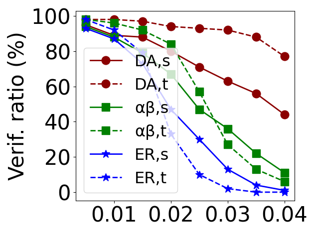
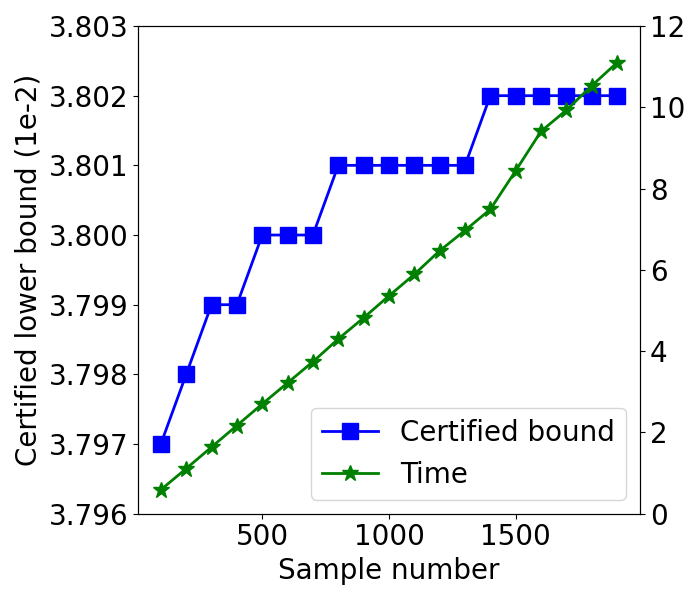
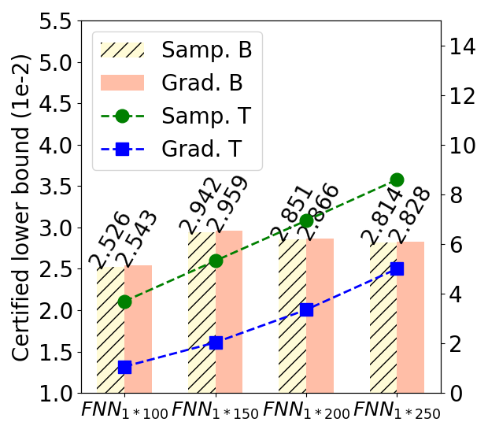

# DualApp
DualApp is a prototype tool for the robustness verification of neural networks. It is the official implementation for paper [A Tale of Two Approximations: Tightening Over-Approximation for DNN Robustness Verification via Under-Approximation](./A%20Tale%20of%20Two%20Approximations%20Tightening%20Over-Approximation%20for%20DNN%20Robustness%20Verification%20via%20Under-Approximation.pdf). In this project, we propose a dual-approximation approach to tighten over-approximations, leveraging an activation function's underestimated domain to define tight approximation bounds.We assess it on a comprehensive benchmark of DNNs with different architectures. Our experimental results show that DualApp significantly outperforms the state-of-the-art approaches on the verified robustness ratio and the certified lower bound. 

## Project Structure
> - Define approximation of activation functions:
>    - activations.py
>    - cnn_bounds_core.py
>    - cnn_bounds.
>    - cnn_bounds_for_figure_3.py
> - Dataset and loader:
>    - data/
>    - utils.py
>    - setup_cifar.py
>    - setup_mnist.py
> - Benchmarks:
>    - pretrained_model/
> - Generate results in Paper:
>    - main_figure_8.py
>    - main_figure_9.py
>    - main_figure_10.py
>    - main_table_1.py
>    - main_figure_3_approximation_domain.py
>    - main_figure_3_actual_domain.py
> - Draw Pictures and Table in Paper: 
>    - draw_figure_3/draw.py
>    - draw_figure_8/draw.py
>    - draw_figure_9/draw.py
>    - draw_figure_10/draw.py
>    - draw_table/draw_table_1.py
> - Log file:
>    - logs/
> - Others


## Getting Started
***

### Start From Docker
For simplify, we provide a docker image to run:

1. Download the docker image from https://figshare.com/articles/software/DualApp/23173448.

2. Load the docker image.
    ```
    docker load -i dualapp.tar
    ```
3. Start a container with the image.
    ```
     docker run -it dualapp:v1 /bin/bash
    ```
4. Navigate to the project directory.
    ```
    cd /root/DualApp
    conda activate dualapp
    ```

5. Run demo to get parts of the results of DualApp in Table 1, including CNN 4-5 on Mnist and FNN 5*100 on Cifar-10.
    ```
    nohup ./run_demo.sh >logs/run_demo.log &
    ```
    After the command finishes running, the results are organized into tabular data in *CSV* format and stored in **draw_table/demo_table.csv**. 

    |Dataset|Model|Nodes|DA bounds|DA time (s)|
    |----|----|----|----|----|
    |Mnist|CNN 4-5|8690|0.05816|12.45|
    |Cifar-10|FNN 5x100|510|0.00370|11.32|


### Install Step-By-Step

We also provide commands that will install all the necessary dependencies step by step(sudo rights might be required). 

1. Install dependencies.
    ```
    sudo apt update
    sudo apt upgrade -y
    sudo apt install build-essential zlib1g-dev libbz2-dev libncurses5-dev libgdbm-dev libnss3-dev libssl-dev libreadline-dev libffi-dev
    sudo apt-get install -y libgl1-mesa-dev
    sudo apt-get install libglib2.0-dev
    ```
2. Install miniconda.
    ```
    wget https://repo.anaconda.com/miniconda/Miniconda3-latest-Linux-x86_64.sh
    ./Miniconda3-latest-Linux-x86_64.sh
    ```
3. Create a virtual python environment and install all the required python dependencies(such as numpy and tensorflow).
    ```
    git clone https://github.com/13luoyu/DualApp.git
    cd DualApp
    conda create -n dualapp python=3.7.5
    conda activate dualapp
    pip install -r requirements.txt
    ```
4. Modify one file of tensorflow package.
    ```
    python modify_file.py
    ```

5. Run demo to get parts of the results of DualApp in Table 1, including CNN 4-5 on Mnist and FNN 5*100 on Cifar-10.
    ```
    nohup ./run_demo.sh >logs/run_demo.log &
    ```
    After the command finishes running, the results are organized into tabular data in *CSV* format and stored in **draw_table/demo_table.csv**. 

    |Dataset|Model|Nodes|DA bounds|DA time (s)|
    |----|----|----|----|----|
    |Mnist|CNN 4-5|8690|0.05816|12.45|
    |Cifar-10|FNN 5x100|510|0.00370|11.32|


## Detailed Instructions

1. To obtain the results in Figure 8, run:
    ```
    nohup ./run_figure_8.sh >logs/run_figure_8.log &
    ```
    After the command finishes running, the process will reorganize the log and draw figures. The figures are stored in **draw_figure_8/**, e.g., the result figure for verifying the fc model trained on Mnist with normal method (Figure 8(a)) is **draw_figure_8/mnist_fc_normal.png**.
    
    


2. To obtain the results in Table 1, run:
    ```
    nohup ./run_table_1.sh >logs/run_table_1.log &
    ```

    After the command finishes running, the results are organized into tabular data in *CSV* format and stored in **draw_table/table_1.csv**. Example output of Table 1 (on Mnist) are:
    
    | Dataset | Model | Nodes | DA Bounds | NW Bounds | NW Impr (%) | DC Bounds | DC Impr (%) | VN Bounds | VN Impr (%) | RV Bounds | RV Impr (%) | DA Time (s) | Others Time (s) |
    |--|--------|-------------|--|--|--|--|--|--|--|--|--|--|--|
    | Mnist|CNN 4-5|8690|0.05819|0.05698|2.12|0.05394|7.88|0.05425|7.26|0.05220|11.48|14.88|1.42|
    |  | CNN 5-5|10690|0.05985|0.05813|2.96|0.05481|9.2|0.05503|8.76|0.05125|16.78|24.41|3.54|
    |  | CNN 6-5|12300|0.06450|0.06235|3.45|0.05898|9.36|0.05882|9.66|0.05409|19.25|30.91|7.04|
    |  | CNN 8-5|14570|0.11412|0.11907|-4.16|0.08782|29.95|0.08819|29.4|0.06853|66.53|39.28|13.35|
    |  | FNN 5x100|510|0.00635|0.00575|10.43|0.00607|4.61|0.00616|3.08|0.00519|22.35|12.53|5.34|
    |  | FNN 6x200|1210|0.02976|0.02909|2.3|0.02511|18.52|0.02829|5.2|0.01812|64.24|56.76|99.09|

3. To obtain the results in Figure 9, run:
    ```
    nohup ./run_figure_9.sh >logs/run_figure_9.log &
    ```
    After the command finishes running, the process will reorganize the log and draw figures. The figures are stored in **draw_figure_9/**, e.g., the result figure for exploring the influence of sampling number in Monte Carlo method (Figure 9(a)) is **draw_figure_9/Sampling_fashion_mnist_fnn.png**.
    
    

4. To obtain the results in Figure 10, run:
    ```
    nohup ./run_figure_10.sh >logs/run_figure_10.log &
    ```
    After the command finishes running, the process will reorganize the log and draw figures. The figures are stored in **draw_figure_10/**, e.g., the result figure for comparison of Monte Carlo and gradient-based method on FNN and Mnist (Figure 10(a)) is **draw_figure_10/GD_sample_mnist_fnn.png**.
    
    


The corresbonding pretrained models are provided in the folder **pretrained_model/**. Note that we just submit models used in the experiments in body part of the paper due to the limit of supplementary material. You can refer to https://github.com/13luoyu/trained_network for other models used in our [Technical Report](issta2023-DualApp-TR.pdf) Appendix C. 

Results will be saved in **logs/**. The full logs and results are saved in **logs/run_\*.log**. The simplified results of FNNs will be saved in **logs/cnn_bounds_full_with_LP_xxx.txt**, and that of CNNs will be saved in **logs/cnn_bounds_full_core_with_LP_xxx.txt**, where xxx refers to the time stamp.


## Interface

### In cnn_bounds.py
```
run_certified_bounds(file_name, n_samples, p_n, q_n, data_from_local=True, method='NeWise', sample_num=0, cnn_cert_model=False, vnn_comp_model=False, eran_fnn=False, eran_cnn=False, activation = 'sigmoid', mnist=False, cifar=False, fashion_mnist=False, gtsrb=False, step_tmp = 0.45)
```
This function is used to compute the certified lower bound of a FNN. 
- file_name: The ".h5" file to verify. It must be a **Keras** model. 
- n_samples: Number of images to verify. 
- p_n: set it 105. 
- q_n: set it 1. 
- data_from_local: If use the images in **data/**, set it *True*, else set it *False*.
- method: The approximation approach to verify. In our method, it can be *"guided_by_endpoint"* for Monte Carlo under-approximation Algorithm or *"gradient_descent"* for gradient-based algorithm. Other methods including *"NeWise"*, *"DeepCert"*, *"VeriNet"*, and *"RobustVerifier"* are supported. 
- sample_num: If use the Monte Carlo under-approximation algorithm, it is the sample number for each image, like 1000.
- eran_fnn: As the models of Figure 8 are from ERAN, set it *True* if needed. 
- activation: The activation function used in neural network verification, like *"sigmoid"*, *"tanh"*, and *"arctan"*. 
- mnist: If the dataset is MNIST, set it *True*.
- fashion_mnist: If the dataset is Fashion MNIST, set it *True*.
- cifar: If the dataset is CIFAR-10, set it *True*.
- step_tmp: If use the gradient-based under-approximation algorithm, it is the step length of the gradient descent, like 0.45. 

```
run_verified_robustness_ratio(file_name, n_samples, p_n, q_n, data_from_local=True, method='NeWise', sample_num=0, cnn_cert_model=False, vnn_comp_model=False, eran_fnn=False, eran_cnn=False, activation = 'sigmoid', mnist=False, cifar=False, fashion_mnist=False, gtsrb=False, step_tmp = 0.45, eps=0.005)
```
This function is used to compute the verified robustness ratio of a FNN.
- file_name: The ".h5" file to verify. It must be a **Keras** model. 
- n_samples: Number of images to verify. 
- p_n: set it 105. 
- q_n: set it 1. 
- data_from_local: If use the images in **data/**, set it *True*, else set it *False*.
- method: The approximation approach to verify. In our method, it can be *"guided_by_endpoint"* for Monte Carlo under-approximation Algorithm or *"gradient_descent"* for gradient-based algorithm. Other methods including *"NeWise"*, *"DeepCert"*, *"VeriNet"*, and *"RobustVerifier"* are supported. 
- sample_num: If use the Monte Carlo under-approximation algorithm, it is the sample number for each image, like 1000.
- eran_fnn: As the models of Figure 8 are from ERAN, set it *True* if needed. 
- activation: The activation function used in neural network verification, like *"sigmoid"*, *"tanh"*, and *"arctan"*. 
- mnist: If the dataset is MNIST, set it *True*.
- fashion_mnist: If the dataset is Fashion MNIST, set it *True*.
- cifar: If the dataset is CIFAR-10, set it *True*.
- step_tmp: If use the gradient-based under-approximation algorithm, it is the step length of the gradient descent, like 0.45. 
- eps: The size of perturbation under which we verify the neural network. 


### In cnn_bounds_core.py
```
run_certified_bounds_core(file_name, n_samples, p_n, q_n, data_from_local=True, method='NeWise', sample_num=0, cnn_cert_model=False, activation = 'sigmoid', mnist=False, cifar=False, fashion_mnist=False, gtsrb=False, step_tmp = 0.45, eran_fnn=False)
```
This function is used to compute the certified lower bound of a CNN.

```
run_verified_robustness_ratio_core(file_name, n_samples, p_n, q_n, data_from_local=True, method='NeWise', sample_num=0, cnn_cert_model=False, activation = 'sigmoid', mnist=False, cifar=False, fashion_mnist=False, gtsrb=False, step_tmp = 0.45, eps=0.002, eran_fnn=False)
```
This function is used to compute the verified robustness ratio of a CNN.


